# Andrew Stalker - Principal Software Engineer

## Professional Overview

Strategic Principal Software Engineer and Army veteran with 9+ years building greenfield products and modernizing legacy systems in insurance tech. Currently leading teams at Liberty Mutual to deliver new products on modern stacks, architecting event-driven platforms, and establishing technical standards adopted across partners—achieving zero-downtime releases and 30% faster time-to-market via Agentic AI. Military Signals Intelligence background sharpened pattern recognition, real-time decision-making, and the ability to lead cross-functional teams through high-pressure delivery.

---

## Career Timeline & Progression

```mermaid
graph LR
    A["🪖 Military Service<br/>Feb 2006 - Jul 2013<br/>SIGINT Analyst & Scout Leader<br/>US Army Airborne"] --> B["🎓 Education<br/>2013 - 2016<br/>Bachelor of Science<br/>Computer Science<br/>Purdue University"]
    
    B --> C["🏢 Purdue University<br/>Mar 2015 - Dec 2016<br/>Lead Full Stack Web Developer<br/>Enterprise Infrastructure Suite<br/>C#, ASP.NET, SQL Server"]
    
    C --> D["💼 Liberty Mutual - Early Career<br/>Dec 2017 - Apr 2020<br/>Software Engineer<br/>Full-stack insurance systems<br/>Java/Spring, Angular, AWS"]
    
    D --> E["📈 Liberty Mutual - Growth<br/>Apr 2020 - Aug 2023<br/>Senior Software Engineer<br/>Scalable web applications<br/>NgRx, Async Algorithms"]
    
    E --> F["⭐ Liberty Mutual - Leadership<br/>Aug 2023 - Present<br/>Principal Software Engineer<br/>Technical Standards & Strategy<br/>Team Leadership & AI Integration"]
    
    style A fill:#e8f4f8
    style B fill:#fff4e8
    style C fill:#f0e8ff
    style D fill:#e8ffe8
    style E fill:#ffe8f0
    style F fill:#fff9e8
```



### Career Progression Summary

- **Military to Tech (2006-2013)**: Developed discipline, pattern recognition, and decision-making under pressure
- **Education & Early Work (2013-2020)**: Built strong technical foundation with enterprise experience
- **Technical Growth (2020-2023)**: Advanced from individual contributor to senior engineer, mastering complex systems
- **Technical Leadership (2023-Present)**: Leading teams, defining technical strategy, and driving organizational modernization

---

## This Resume Application - Architecture & Design

This resume is a **production-quality React application** demonstrating modern full-stack development principles using **Tailwind CSS** for utility-first, responsive styling and **Vite** for optimized builds.

### Tech Stack

| Layer | Technology | Purpose |
|-------|-----------|---------|
| **Framework** | React 19 | Modern UI component library with concurrent rendering |
| **Language** | TypeScript 5.9 | Static type checking for reliability and developer experience |
| **Styling** | Tailwind CSS 3.4 | Utility-first CSS framework with custom Zed theme |
| **Build Tool** | Vite 7 | Ultra-fast development and optimized production builds |
| **CSS Processing** | PostCSS + Autoprefixer | Standards-based CSS transformations and browser compatibility |
| **Linting** | ESLint 9 | Code quality and consistency checks |
| **Deployment** | GitHub Pages | Free, fast, version-controlled hosting |

### Project Structure & Benefits

```
src/
├── components/              # Isolated, reusable React components
│   ├── Sidebar.tsx         # Profile sidebar (sticky on desktop)
│   ├── CompanyHeader.tsx   # Company information display
│   ├── Experience.tsx      # Expandable work history
│   ├── Skills.tsx          # Categorized technical skills
│   ├── Education.tsx       # Educational background
│   ├── Projects.tsx        # Notable projects
│   └── Footer.tsx          # Footer attribution
├── data/
│   └── resume.json         # Single source of truth for all content
├── types/
│   └── resume.ts           # TypeScript type definitions
├── styles/
│   ├── print.css           # Print/PDF optimization
│   ├── index.css           # Global styles and Tailwind
│   └── App.css             # Component-specific styles
├── assets/                 # Images and static files
└── App.tsx                 # Main application component
```

#### **Design Principles**

**1. Component-Based Architecture**
- Each section is self-contained and independently reusable
- Changes are isolated, reducing ripple effects
- Easy to extend with new components (Projects, Certifications, etc.)
- Clean separation of concerns

**2. Data-Driven Content**
- All resume content lives in `resume.json` - **no hardcoded text**
- Components automatically reflect data updates
- Easy to export data to other formats (API, PDF, etc.)
- Single source of truth for maintainability

**3. Type Safety (TypeScript)**
- Compile-time error detection prevents runtime bugs
- IDE autocomplete and inline documentation
- Self-documenting code through TypeScript interfaces
- Confident refactoring with full type checking

**4. Responsive Design (Tailwind CSS)**
- Mobile-first responsive utilities
- Custom Zed color theme (inspired by Zed Editor)
- Semantic color naming (`.text-zed-text`, `.bg-zed-surface`)
- Monospace typography throughout (Fira Code font)
- Flexible spacing and layout helpers

**5. Performance Optimizations**
- **Vite**: Instant hot-module replacement in development
- **Tree Shaking**: Automatic unused code removal in production
- **Code Splitting**: Only load required modules
- **Optimized Bundle**: Minimal gzipped output
- **Lazy Loading**: Components load on demand

**6. User Experience**
- **Responsive Layout**: Fixed sidebar on desktop, stacked on mobile
- **Print-Ready**: Professional PDF output with Ctrl+P
- **Fast Navigation**: Smooth scrolling and instant interactions
- **Accessible**: Semantic HTML and keyboard navigation
- **Monospace Theme**: Clean, code-editor aesthetic
- **Fast Loading**: Instant page load, smooth interactions

---

## Running Locally

```bash
# Install dependencies
cd the-resume
npm install

# Start development server
npm run dev
# Open http://localhost:5173

# Build for production
npm run build
```

---

## Key Features

✅ **Responsive Design** - Mobile-first with Tailwind CSS utilities  
✅ **Interactive Components** - Expandable sections, smooth interactions  
✅ **Type-Safe** - Full TypeScript for runtime reliability  
✅ **Data-Driven Architecture** - Single JSON source of truth  
✅ **Print-Optimized** - Export as professional PDF with Ctrl+P  
✅ **Lightning Fast** - Vite build, optimized production bundles  
✅ **Accessible** - Semantic HTML, keyboard navigation  
✅ **Custom Theme** - Zed editor-inspired monospace aesthetic  

---

## Deployment

Suitable for:
- **GitHub Pages** - Free, automatic deployment
- **Vercel** - Zero-config, preview deploys
- **Netlify** - Drag-and-drop, built-in CI/CD
- **AWS S3 + CloudFront** - Scalable, globally distributed
- **Any static host** - Works with all CDNs

---

## Contact
🔗 [GitHub](https://github.com/drewjst)  
💼 [LinkedIn](https://linkedin.com)  

---

*Built with React + Tailwind CSS | Vite | TypeScript*
