# Andrew Stalker - Principal Software Engineer

## Professional Overview

Results-driven Principal Software Engineer with 9+ years of full-stack experience architecting high-scale distributed systems and microservices ecosystems. Proven technical leader specializing in modern stack migrations and cloud-native architectures. Excel at guiding cross-functional teams, mentoring engineers, and leveraging modern AI tools to boost performance. Experienced in high-pressure environments delivering scalable solutions that prioritize clarity, iteration, and operational excellence.

---

## Career Timeline & Progression

```mermaid
graph LR
    A["🪖 Military Service<br/>Feb 2006 - Jul 2013<br/>SIGINT Analyst & Scout Leader<br/>US Army Airborne"] --> B["🎓 Education<br/>2013 - 2016<br/>Bachelor of Science<br/>Computer Science<br/>Purdue University"]
    
    B --> C["🏢 Purdue University<br/>Mar 2015 - Dec 2016<br/>Lead Full Stack Web Developer<br/>Enterprise Infrastructure Suite<br/>C#, ASP.NET, SQL Server"]
    
    C --> D["💼 Liberty Mutual - Early Career<br/>Dec 2017 - Apr 2020<br/>Software Engineer<br/>Full-stack insurance systems<br/>Java/Spring, Angular, AWS"]
    
    D --> E["📈 Liberty Mutual - Growth<br/>Apr 2020 - Aug 2023<br/>Senior Software Engineer<br/>Scalable web applications<br/>NgRx, Async Algorithms"]
    
    E --> F["⭐ Liberty Mutual - Leadership<br/>Aug 2023 - Present<br/>Principal Software Engineer<br/>Technical Standards & Strategy<br/>Team Leadership & AI Integration"]
    
    style A fill:#e8f4f8
    style B fill:#fff4e8
    style C fill:#f0e8ff
    style D fill:#e8ffe8
    style E fill:#ffe8f0
    style F fill:#fff9e8
```



### Career Progression Summary

- **Military to Tech (2006-2013)**: Developed discipline, pattern recognition, and decision-making under pressure
- **Education & Early Work (2013-2020)**: Built strong technical foundation with enterprise experience
- **Technical Growth (2020-2023)**: Advanced from individual contributor to senior engineer, mastering complex systems
- **Technical Leadership (2023-Present)**: Leading teams, defining technical strategy, and driving organizational modernization

---

## This Resume Application - Architecture & Design

This resume is a **production-quality React application** demonstrating modern full-stack development principles using **Material-UI** for enterprise-grade styling.

### Project Structure & Benefits

```
the-resume/
├── src/
│   ├── components/           # Isolated, reusable UI components
│   │   ├── Header.tsx        # Professional header with contact
│   │   ├── Experience.tsx    # Expandable accordion job history
│   │   ├── Skills.tsx        # Categorized skills with chips
│   │   ├── Education.tsx     # Education summary
│   │   └── Footer.tsx        # Footer attribution
│   ├── data/
│   │   └── resume.json       # Single source of truth
│   ├── types/
│   │   └── resume.ts         # TypeScript interfaces
│   ├── styles/
│   │   └── print.css         # PDF export styling
│   └── App.tsx               # Main application
```

#### **Why This Architecture?**

**1. Component-Based Design**
- Each section is self-contained and reusable
- Easy to add new sections (e.g., Projects, Certifications)
- Changes in one component don't cascade through the app
- Perfect for scaling to larger applications

**2. Data-Driven System**
- All content lives in `resume.json` - change data, not code
- Components automatically reflect updates
- Easy to export data to different formats (PDF, JSON API, etc.)
- Separates content from presentation

**3. Type Safety (TypeScript)**
- Prevents bugs at compile time, not runtime
- IDE provides autocomplete and documentation
- Self-documenting code through interfaces
- Safer refactoring with compile-time checks

**4. Material-UI (Enterprise Design)**
- Professional, polished look out of the box
- WCAG accessible components
- 2000+ icons for rich visual design
- Responsive grid system for all devices
- Customizable theming

**5. Performance**
- **Vite**: Lightning-fast builds and hot reload
- **Tree Shaking**: Unused code automatically removed
- **Code Splitting**: Only load what's needed
- **Optimized Bundle**: <50KB gzipped for production

**6. User Experience**
- **Accordion Sections**: Expand/collapse for clean layout
- **Responsive Design**: Perfect on mobile, tablet, desktop
- **Print-Ready**: Ctrl+P exports as professional PDF
- **Fast Loading**: Instant page load, smooth interactions

---

## Technology Stack

| Layer | Technology | Purpose |
|-------|-----------|---------|
| **Language** | TypeScript | Type-safe development |
| **Framework** | React 19 | Component-based UI |
| **UI Library** | Material-UI (MUI) | Enterprise components |
| **Icons** | MUI Icons | Professional iconography |
| **Styling** | MUI sx prop + CSS | Flexible styling |
| **Bundler** | Vite | Fast builds & dev server |
| **Package Mgr** | npm | Dependency management |

---

## Running Locally

```bash
# Install dependencies
cd the-resume
npm install

# Start development server
npm run dev
# Open http://localhost:5173

# Build for production
npm run build
```

---

## Key Features

✅ **Responsive** - Mobile-first, all screen sizes  
✅ **Interactive** - Expandable sections, smooth UX  
✅ **Type-Safe** - Full TypeScript, zero runtime type errors  
✅ **Data-Driven** - Single source of truth in JSON  
✅ **Print-Friendly** - Export as PDF with one click  
✅ **Fast** - Optimized build, instant loads  
✅ **Accessible** - WCAG compliant, screen reader support  
✅ **Professional** - Enterprise-grade Material-UI design  

---

## Deployment

Suitable for:
- **GitHub Pages** - Free, automatic deployment
- **Vercel** - Zero-config, preview deploys
- **Netlify** - Drag-and-drop, built-in CI/CD
- **AWS S3 + CloudFront** - Scalable, globally distributed
- **Any static host** - Works with all CDNs

---

## Contact
🔗 [GitHub](https://github.com/drewjst)  
💼 [LinkedIn](https://linkedin.com)  

---

*Built with React + Material-UI | Vite | TypeScript*
