# Andrew Stalker - Principal Software Engineer

## Professional Overview

Results-driven Principal Software Engineer with 9+ years of full-stack experience architecting high-scale distributed systems and microservices ecosystems. Proven technical leader specializing in modern stack migrations and cloud-native architectures. Excel at guiding cross-functional teams, mentoring engineers, and leveraging modern AI tools to boost performance. Experienced in high-pressure environments delivering scalable solutions that prioritize clarity, iteration, and operational excellence.

---

## Career Timeline & Progression

```mermaid
graph LR
    A["🪖 Military Service<br/>Feb 2006 - Jul 2013<br/>SIGINT Analyst & Scout Leader<br/>US Army Airborne"] --> B["🎓 Education<br/>2013 - 2016<br/>Bachelor of Science<br/>Computer Science<br/>Purdue University"]
    
    B --> C["🏢 Purdue University<br/>Mar 2015 - Dec 2016<br/>Lead Full Stack Web Developer<br/>Enterprise Infrastructure Suite<br/>C#, ASP.NET, SQL Server"]
    
    C --> D["💼 Liberty Mutual - Early Career<br/>Dec 2017 - Apr 2020<br/>Software Engineer<br/>Full-stack insurance systems<br/>Java/Spring, Angular, AWS"]
    
    D --> E["📈 Liberty Mutual - Growth<br/>Apr 2020 - Aug 2023<br/>Senior Software Engineer<br/>Scalable web applications<br/>NgRx, Async Algorithms"]
    
    E --> F["⭐ Liberty Mutual - Leadership<br/>Aug 2023 - Present<br/>Principal Software Engineer<br/>Technical Standards & Strategy<br/>Team Leadership & AI Integration"]
    
    style A fill:#e8f4f8
    style B fill:#fff4e8
    style C fill:#f0e8ff
    style D fill:#e8ffe8
    style E fill:#ffe8f0
    style F fill:#fff9e8
```



## This Resume Application - Architecture & Design

This resume is a **production-quality React application** designed with a **"Zed" Editor Aesthetic**. It combines the utility of a standard resume with the visual language of a modern developer environment—clean, minimal, and code-centric.

### Project Structure

```
the-resume/
├── src/
│   ├── components/
│   │   ├── Sidebar.tsx       # Persistent sidebar with contact/socials
│   │   ├── CompanyHeader.tsx # Quick-link chips for employers/education
│   │   ├── Experience.tsx    # Clean, flat-design job history
│   │   ├── Skills.tsx        # Categorized skill tags
│   │   ├── Education.tsx     # Education summary
│   │   └── Footer.tsx        # Simple copyright footer
│   ├── data/
│   │   └── resume.json       # Single source of truth
│   ├── types/
│   │   └── resume.ts         # TypeScript interfaces
│   ├── styles/
│   │   └── print.css         # PDF export styling
│   └── App.tsx               # Main layout (Sidebar + Content)
```

### Design Philosophy: "The Zed Look"

**1. Minimalist & Content-First**
- **Fira Code Typography:** The entire application uses Fira Code, a monospaced font loved by developers, reinforcing the engineering focus.
- **Light Theme Palette:** A custom Tailwind configuration defines the "Zed Light" theme—soft greys (`#fbfbfb` background), subtle borders (`#e5e5e5`), and high-contrast text (`#333333`).
- **Flat Design:** Shadows and "cards" are replaced with clean lines and whitespace to mimic a code editor interface.

**2. Modern Architecture**
- **Sidebar Layout:** Key contact info and actions (like "Download PDF") are always accessible in a fixed sidebar (on desktop).
- **Interactive Headers:** "Chip" style links provide quick access to external company pages.
- **React + Tailwind CSS:** Built for speed and maintainability. Tailwind handles the utility-first styling, allowing for rapid iteration on the custom theme.

**3. Data-Driven & Type-Safe**
- **JSON Data Source:** Content is separated from presentation in `resume.json`.
- **TypeScript:** Ensures robust component logic and safe refactoring.

---

## Technology Stack

| Layer | Technology | Purpose |
|-------|-----------|---------|
| **Language** | TypeScript | Type-safe development |
| **Framework** | React 19 | Component-based UI |
| **Styling** | Tailwind CSS v3 | Utility-first custom theming |
| **Typography** | Fira Code | Developer-centric aesthetic |
| **Icons** | MUI Icons | Professional iconography |
| **Bundler** | Vite | Fast builds & dev server |

---

## Running Locally

```bash
# Install dependencies
cd the-resume
npm install

# Start development server
npm run dev
# Open http://localhost:5173

# Build for production
npm run build
```

---

## Key Features

✅ **Zed Editor Aesthetic** - Minimal, light theme, Fira Code font
✅ **Responsive Layout** - Split-pane (Sidebar/Main) on desktop, stacked on mobile
✅ **Type-Safe** - Full TypeScript integration
✅ **Data-Driven** - Edit `resume.json` to update content
✅ **Print-Friendly** - Styles optimized for PDF export
✅ **Fast** - Vite-powered builds and instant loads

---

## Deployment

Deployable to any static host (GitHub Pages, Vercel, Netlify).
The project includes a `deploy` script for GitHub Pages:

```bash
npm run deploy
```

---

## Contact
🔗 [GitHub](https://github.com/drewjst)  
💼 [LinkedIn](https://linkedin.com)  

---

*Built with React | Tailwind CSS | Vite | TypeScript*
